# ASP.NET Core-2.1 : Simple RESTFul Service with Pagnation and Bootstrap Modal
This project is to demonstrate how to create a simple RESTFul API service with ASP.NET Core 2.1 to provide the data
require by the Application. This project will also cover how to consume RESTFul API service using 

#### Architectural Design 
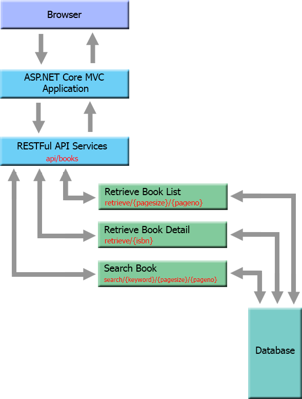

#### Output of the Project

##### Primary View
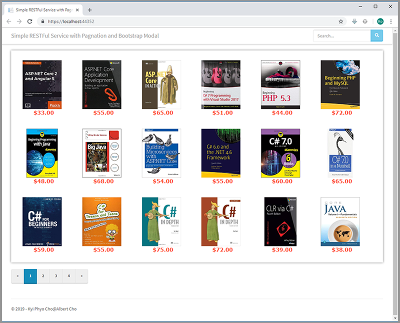

##### Detail Popup
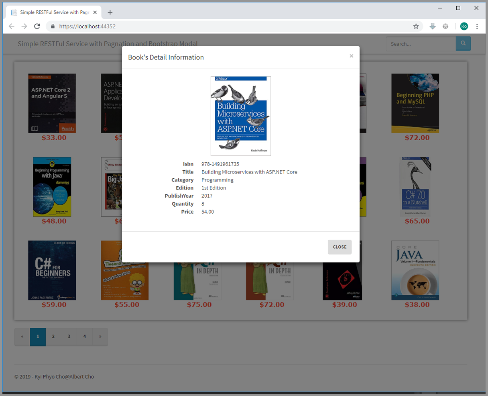

#### Project Overview 
This Project will cover the followings
- Creating the RESTful Web Api Project.
- ----------
- Removing the uncessary views and controller actions.
- Removing the unnecessary tags from _Layout.cshtml and index.cshtml files.
- Creating Models for Movie Table and Pagination.
- Creating Custom DBContext and Data Seeding Function using Base64 JSON string.
- Creating Database using Package Manager Console(Power Shell) or Command Prompt.
- Changing Route Map.
- Pagination using pagination model and home controller.
- Handling multiple models with single view.
- ----------


## Building New RESTFul API project

### Creating New Solution

In Visual studio 2017, create new ASP.NET 2.1 Core solution and select "API" project with "No Authentication" and 
"Configure for HTTPS".

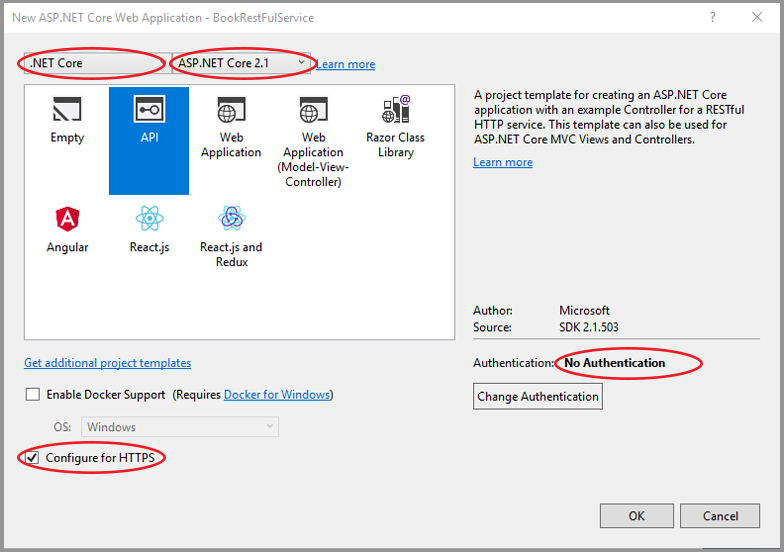

The new solution will created with following folders and files.

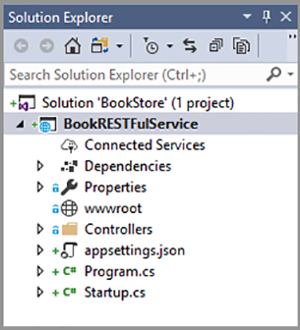

---

### Creating New Models
Create the new folder name _**Models**_ in the solution and create _**Book.cs**_ file inside that Folder.
Declare the fields that require for informations related to the books.

```C#
using System;
using System.Collections.Generic;
using System.ComponentModel.DataAnnotations;
using System.ComponentModel.DataAnnotations.Schema;
using System.Linq;
using System.Threading.Tasks;

namespace BookRESTFulService.Models
{
    public class Book
    {
        [Key]
        [MaxLength(30)]
        public string Isbn          { get; set; }
        [MaxLength(200)]
        public String Title         { get; set; }
        [MaxLength(50)]
        public string Category      { get; set; }
        [MaxLength(50)]
        public string Edition       { get; set; }
        public int PublishYear      { get; set; }
        public int Quantity         { get; set; }
        [Column(TypeName = "decimal(10,2)")]
        public decimal Price        { get; set; }
    }
}
```

Create _**Pagination.cs**_ file in _**Models**_ Folder and declare the fields that require for pagination.

```C#
using System;
using System.Collections.Generic;
using System.Linq;
using System.Threading.Tasks;

namespace BookRESTFulService.Models
{
    public class Pagination
    {
        public int PageNo               { get; set; } = 1;      // Assign Default PageNo to 1.
        public int PageSize             { get; set; } = 18;     // Assign Default PageSize to 18.
        public int TotalCount           { get; set; }
        public int PageButtonCount      { get; set; } = 10;     // Assign Display PageButtonCount to 10;

        public int TotalPages => (int)Math.Ceiling(decimal.Divide(TotalCount, PageSize));
    }
}
```

---

### Create BookDbContext And Data Seeding Function

Create a new folder named _**Data**_ and add new code file named _**BookDBContext.cs**_ file under _**Data**_ folder.

```C#
using BookRESTFulService.Models;
using Microsoft.EntityFrameworkCore;
using Newtonsoft.Json;
using System;
using System.Collections.Generic;
using System.Linq;
using System.Text;
using System.Threading.Tasks;

namespace BookRESTFulService.Data
{
    public class BookDbContext : DbContext
    {
        public BookDbContext(DbContextOptions<BookDbContext> options)
            : base(options)
        {

        }

        public DbSet<Book> Books { get; set; }

        protected override void OnModelCreating(ModelBuilder modelBuilder)
        {
            String bookListBase64JSON = "W3sKCQkiSXNibiI6ICI5NzgtMTQ5MTk4NzY1MCIsCgkJIlRpdGxlIjogIkMjIDcuMCBpbiBhIE51dHNoZWxsIDogVGhlIERlZmluaXRpdmUgUmVmZXJlbmNlIiwKCQkiRWRpdGlvbiI6ICIxc3QgRWRpdGlvbiIsCgkJIkNhdGVnb3J5IjogIlByb2dyYW1taW5nIiwKCQkiUHVibGlzaFllYXIiOiAiMjAxNyIsCgkJIlF1YW50aXR5IjogIjUiLAoJCSJQcmljZSI6ICI2NSIKCX0sCgl7CgkJIklzYm4iOiAiOTc4LTExMTk0NDkyNzAiLAoJCSJUaXRsZSI6ICJQcm9mZXNzaW9uYWwgQyMgNyBhbmQgLk5FVCBDb3JlIDIuMCIsCgkJIkVkaXRpb24iOiAiMXN0IEVkaXRpb24iLAoJCSJDYXRlZ29yeSI6ICJQcm9ncmFtbWluZyIsCgkJIlB1Ymxpc2hZZWFyIjogIjIwMTgiLAoJCSJRdWFudGl0eSI6ICI4IiwKCQkiUHJpY2UiOiAiMzUiCgl9LAoJewoJCSJJc2JuIjogIjk3OC0xNDg0MjMwMTc2IiwKCQkiVGl0bGUiOiAiUHJvIEMjIDc6IFdpdGggLk5FVCBhbmQgLk5FVCBDb3JlIiwKCQkiRWRpdGlvbiI6ICIxc3QgRWRpdGlvbiIsCgkJIkNhdGVnb3J5IjogIlByb2dyYW1taW5nIiwKCQkiUHVibGlzaFllYXIiOiAiMjAxNyIsCgkJIlF1YW50aXR5IjogIjUiLAoJCSJQcmljZSI6ICI0MCIKCX0sCgl7CgkJIklzYm4iOiAiOTc4LTE1MDkzMDc3NjAiLAoJCSJUaXRsZSI6ICJNaWNyb3NvZnQgVmlzdWFsIEMjIFN0ZXAgYnkgU3RlcCAiLAoJCSJFZGl0aW9uIjogIjl0aCBFZGl0aW9uIiwKCQkiQ2F0ZWdvcnkiOiAiUHJvZ3JhbW1pbmciLAoJCSJQdWJsaXNoWWVhciI6ICIyMDE4IiwKCQkiUXVhbnRpdHkiOiAiNyIsCgkJIlByaWNlIjogIjMxIgoJfSwKCXsKCQkiSXNibiI6ICI5NzgtMTYxNzI5MTM0MCIsCgkJIlRpdGxlIjogIkMjIGluIERlcHRoIiwKCQkiRWRpdGlvbiI6ICIzcmQgRWRpdGlvbiIsCgkJIkNhdGVnb3J5IjogIlByb2dyYW1taW5nIiwKCQkiUHVibGlzaFllYXIiOiAiMjAxNCIsCgkJIlF1YW50aXR5IjogIjMiLAoJCSJQcmljZSI6ICI3NSIKCX0sCgl7CgkJIklzYm4iOiAiOTc4LTE1MTg4Nzc1NTEiLAoJCSJUaXRsZSI6ICJDIyBGb3IgQmVnaW5uZXJzIDogVGhlIHRhY3RpY2FsIGd1aWRlYm9vayAiLAoJCSJFZGl0aW9uIjogIjJuZCBFZGl0aW9uIiwKCQkiQ2F0ZWdvcnkiOiAiUHJvZ3JhbW1pbmciLAoJCSJQdWJsaXNoWWVhciI6ICIyMDE1IiwKCQkiUXVhbnRpdHkiOiAiNiIsCgkJIlByaWNlIjogIjU5IgoJfSwKCXsKCQkiSXNibiI6ICI5NzgtMTk3MzcyNzc2NyIsCgkJIlRpdGxlIjogIkMjIGZvciBUd2VlbnMgYW5kIFRlZW5zIiwKCQkiRWRpdGlvbiI6ICI0dGggRWRpdGlvbiIsCgkJIkNhdGVnb3J5IjogIlByb2dyYW1taW5nIiwKCQkiUHVibGlzaFllYXIiOiAiMjAxNSIsCgkJIlF1YW50aXR5IjogIjgiLAoJCSJQcmljZSI6ICI1NSIKCX0sCgl7CgkJIklzYm4iOiAiOTc4LTE4OTA3NzQ5NDMiLAoJCSJUaXRsZSI6ICJNdXJhY2gncyBDIyAyMDE1ICIsCgkJIkVkaXRpb24iOiAiNnRoIEVkaXRpb24iLAoJCSJDYXRlZ29yeSI6ICJQcm9ncmFtbWluZyIsCgkJIlB1Ymxpc2hZZWFyIjogIjIwMTYiLAoJCSJRdWFudGl0eSI6ICI5IiwKCQkiUHJpY2UiOiAiNDIiCgl9LAoJewoJCSJJc2JuIjogIjk3OC0xNjE3Mjk0NTMyIiwKCQkiVGl0bGUiOiAiQyMgaW4gRGVwdGgiLAoJCSJFZGl0aW9uIjogIjR0aCBFZGl0aW9uIiwKCQkiQ2F0ZWdvcnkiOiAiUHJvZ3JhbW1pbmciLAoJCSJQdWJsaXNoWWVhciI6ICIyMDE4IiwKCQkiUXVhbnRpdHkiOiAiNSIsCgkJIlByaWNlIjogIjcyIgoJfSwKCXsKCQkiSXNibiI6ICI5NzgtMTExOTQyODExNCIsCgkJIlRpdGxlIjogIkMjIDcuMCBBbGwtaW4tT25lIEZvciBEdW1taWVzIiwKCQkiRWRpdGlvbiI6ICIxc3QgRWRpdGlvbiIsCgkJIkNhdGVnb3J5IjogIlByb2dyYW1taW5nIiwKCQkiUHVibGlzaFllYXIiOiAiMjAxOCIsCgkJIlF1YW50aXR5IjogIjQiLAoJCSJQcmljZSI6ICI2MCIKCX0sCgl7CgkJIklzYm4iOiAiOTc4LTE0NDkzNDM1MDciLAoJCSJUaXRsZSI6ICJIZWFkIEZpcnN0IEMjIiwKCQkiRWRpdGlvbiI6ICIzcmQgRWRpdGlvbiIsCgkJIkNhdGVnb3J5IjogIlByb2dyYW1taW5nIiwKCQkiUHVibGlzaFllYXIiOiAiMjAxNiIsCgkJIlF1YW50aXR5IjogIjAiLAoJCSJQcmljZSI6ICI2MyIKCX0sCgl7CgkJIklzYm4iOiAiOTc4LTA3MzU2Njc0NTciLAoJCSJUaXRsZSI6ICJDTFIgdmlhIEMjIChEZXZlbG9wZXIgUmVmZXJlbmNlKSIsCgkJIkVkaXRpb24iOiAiNHRoIEVkaXRpb24iLAoJCSJDYXRlZ29yeSI6ICJQcm9ncmFtbWluZyIsCgkJIlB1Ymxpc2hZZWFyIjogIjIwMTIiLAoJCSJRdWFudGl0eSI6ICIyIiwKCQkiUHJpY2UiOiAiMzkiCgl9LAoJewoJCSJJc2JuIjogIjk3OC0xMTE5NDU4Njg1IiwKCQkiVGl0bGUiOiAiQmVnaW5uaW5nIEMjIDcgUHJvZ3JhbW1pbmcgd2l0aCBWaXN1YWwgU3R1ZGlvIDIwMTciLAoJCSJFZGl0aW9uIjogIjFzdCBFZGl0aW9uIiwKCQkiQ2F0ZWdvcnkiOiAiUHJvZ3JhbW1pbmciLAoJCSJQdWJsaXNoWWVhciI6ICIyMDE4IiwKCQkiUXVhbnRpdHkiOiAiMiIsCgkJIlByaWNlIjogIjUxIgoJfSwKCXsKCQkiSXNibiI6ICI5NzgtMTQ4NDIxMzMzOSIsCgkJIlRpdGxlIjogIkMjIDYuMCBhbmQgdGhlIC5ORVQgNC42IEZyYW1ld29yayIsCgkJIkVkaXRpb24iOiAiN3RoIEVkaXRpb24iLAoJCSJDYXRlZ29yeSI6ICJQcm9ncmFtbWluZyIsCgkJIlB1Ymxpc2hZZWFyIjogIjIwMTUiLAoJCSJRdWFudGl0eSI6ICI0IiwKCQkiUHJpY2UiOiAiNTUiCgl9LAoJewoJCSJJc2JuIjogIjk3OC0xNTA5MzAzNTg4IiwKCQkiVGl0bGUiOiAiRXNzZW50aWFsIEMjIDcuMCIsCgkJIkVkaXRpb24iOiAiNnRoIEVkaXRpb24iLAoJCSJDYXRlZ29yeSI6ICJQcm9ncmFtbWluZyIsCgkJIlB1Ymxpc2hZZWFyIjogIjIwMTgiLAoJCSJRdWFudGl0eSI6ICIwIiwKCQkiUHJpY2UiOiAiNTgiCgl9LAoJewoJCSJJc2JuIjogIjk3OC0xNDkxOTc4OTE3IiwKCQkiVGl0bGUiOiAiTGVhcm5pbmcgUEhQLCBNeVNRTCAmIEphdmFTY3JpcHQiLAoJCSJFZGl0aW9uIjogIjV0aCBFZGl0aW9uIiwKCQkiQ2F0ZWdvcnkiOiAiUHJvZ3JhbW1pbmciLAoJCSJQdWJsaXNoWWVhciI6ICIyMDE4IiwKCQkiUXVhbnRpdHkiOiAiMSIsCgkJIlByaWNlIjogIjQ3IgoJfSwKCXsKCQkiSXNibiI6ICI5NzgtMDEzNDMwMTg0NiIsCgkJIlRpdGxlIjogIlBIUCBhbmQgTXlTUUwgZm9yIER5bmFtaWMgV2ViIFNpdGVzIiwKCQkiRWRpdGlvbiI6ICI1dGggRWRpdGlvbiIsCgkJIkNhdGVnb3J5IjogIlByb2dyYW1taW5nIiwKCQkiUHVibGlzaFllYXIiOiAiMjAxOCIsCgkJIlF1YW50aXR5IjogIjciLAoJCSJQcmljZSI6ICI0MyIKCX0sCgl7CgkJIklzYm4iOiAiOTc4LTExMTkxNDkyMjQiLAoJCSJUaXRsZSI6ICJQSFAgJiBNeVNRTDogU2VydmVyLXNpZGUgV2ViIERldmVsb3BtZW50IiwKCQkiRWRpdGlvbiI6ICIxc3QgRWRpdGlvbiIsCgkJIkNhdGVnb3J5IjogIlByb2dyYW1taW5nIiwKCQkiUHVibGlzaFllYXIiOiAiMjAxOSIsCgkJIlF1YW50aXR5IjogIjUiLAoJCSJQcmljZSI6ICI1OCIKCX0sCgl7CgkJIklzYm4iOiAiOTc4LTE5NDM4NzIzODEiLAoJCSJUaXRsZSI6ICJNdXJhY2gncyBQSFAgYW5kIE15U1FMIiwKCQkiRWRpdGlvbiI6ICIzcmQgRWRpdGlvbiIsCgkJIkNhdGVnb3J5IjogIlByb2dyYW1taW5nIiwKCQkiUHVibGlzaFllYXIiOiAiMjAxNyIsCgkJIlF1YW50aXR5IjogIjEiLAoJCSJQcmljZSI6ICI2MCIKCX0sCgl7CgkJIklzYm4iOiAiOTc4LTE0OTE5MDUwMTIiLAoJCSJUaXRsZSI6ICJNb2Rlcm4gUEhQOiBOZXcgRmVhdHVyZXMgYW5kIEdvb2QgUHJhY3RpY2VzIiwKCQkiRWRpdGlvbiI6ICIxc3QgRWRpdGlvbiIsCgkJIkNhdGVnb3J5IjogIlByb2dyYW1taW5nIiwKCQkiUHVibGlzaFllYXIiOiAiMjAxNSIsCgkJIlF1YW50aXR5IjogIjAiLAoJCSJQcmljZSI6ICI2NSIKCX0sCgl7CgkJIklzYm4iOiAiOTc4LTAxMzQyOTEyNTMiLAoJCSJUaXRsZSI6ICJQSFAgZm9yIHRoZSBXZWI6IFZpc3VhbCBRdWlja1N0YXJ0IEd1aWRlIiwKCQkiRWRpdGlvbiI6ICI1dGggRWRpdGlvbiIsCgkJIkNhdGVnb3J5IjogIlByb2dyYW1taW5nIiwKCQkiUHVibGlzaFllYXIiOiAiMjAxNiIsCgkJIlF1YW50aXR5IjogIjMiLAoJCSJQcmljZSI6ICIzNSIKCX0sCgl7CgkJIklzYm4iOiAiOTc4LTE0OTE5MTg2NjEiLAoJCSJUaXRsZSI6ICJMZWFybmluZyBQSFAsIE15U1FMICYgSmF2YVNjcmlwdCIsCgkJIkVkaXRpb24iOiAiNHRoIEVkaXRpb24iLAoJCSJDYXRlZ29yeSI6ICJQcm9ncmFtbWluZyIsCgkJIlB1Ymxpc2hZZWFyIjogIjIwMTUiLAoJCSJRdWFudGl0eSI6ICI0IiwKCQkiUHJpY2UiOiAiNDIiCgl9LAoJewoJCSJJc2JuIjogIjk3OC0xNDQ5MzYzNzU4IiwKCQkiVGl0bGUiOiAiUEhQIENvb2tib29rIiwKCQkiRWRpdGlvbiI6ICIzcmQgRWRpdGlvbiIsCgkJIkNhdGVnb3J5IjogIlByb2dyYW1taW5nIiwKCQkiUHVibGlzaFllYXIiOiAiMjAxNCIsCgkJIlF1YW50aXR5IjogIjUiLAoJCSJQcmljZSI6ICI2MyIKCX0sCgl7CgkJIklzYm4iOiAiOTc4LTExMTk0NjgzODciLAoJCSJUaXRsZSI6ICJQSFAsIE15U1FMLCAmIEphdmFTY3JpcHQgQWxsLWluLU9uZSIsCgkJIkVkaXRpb24iOiAiMXN0IEVkaXRpb24iLAoJCSJDYXRlZ29yeSI6ICJQcm9ncmFtbWluZyIsCgkJIlB1Ymxpc2hZZWFyIjogIjIwMTgiLAoJCSJRdWFudGl0eSI6ICI4IiwKCQkiUHJpY2UiOiAiNTUiCgl9LAoJewoJCSJJc2JuIjogIjk3OC0wMzIxODMzODkxIiwKCQkiVGl0bGUiOiAiUEhQIGFuZCBNeVNRTCBXZWIgRGV2ZWxvcG1lbnQiLAoJCSJFZGl0aW9uIjogIjV0aCBFZGl0aW9uIiwKCQkiQ2F0ZWdvcnkiOiAiUHJvZ3JhbW1pbmciLAoJCSJQdWJsaXNoWWVhciI6ICIyMDE3IiwKCQkiUXVhbnRpdHkiOiAiMCIsCgkJIlByaWNlIjogIjU4IgoJfSwKCXsKCQkiSXNibiI6ICI5NzgtMTQ4NDIwNjM2MiIsCgkJIlRpdGxlIjogIlBIUCBTb2x1dGlvbnMgOiBEeW5hbWljIFdlYiBEZXNpZ24gTWFkZSBFYXN5ICIsCgkJIkVkaXRpb24iOiAiM3JkIEVkaXRpb24iLAoJCSJDYXRlZ29yeSI6ICJQcm9ncmFtbWluZyIsCgkJIlB1Ymxpc2hZZWFyIjogIjIwMTUiLAoJCSJRdWFudGl0eSI6ICIwIiwKCQkiUHJpY2UiOiAiNDMiCgl9LAoJewoJCSJJc2JuIjogIjk3OC0wMzIxODMyMTg0IiwKCQkiVGl0bGUiOiAiUEhQIEFkdmFuY2VkIGFuZCBPYmplY3QtT3JpZW50ZWQgUHJvZ3JhbW1pbmciLAoJCSJFZGl0aW9uIjogIjNyZCBFZGl0aW9uIiwKCQkiQ2F0ZWdvcnkiOiAiUHJvZ3JhbW1pbmciLAoJCSJQdWJsaXNoWWVhciI6ICIyMDEzIiwKCQkiUXVhbnRpdHkiOiAiNCIsCgkJIlByaWNlIjogIjM5IgoJfSwKCXsKCQkiSXNibiI6ICI5NzgtMTQ0OTM5Mjc3MiIsCgkJIlRpdGxlIjogIlByb2dyYW1taW5nIFBIUDogQ3JlYXRpbmcgRHluYW1pYyBXZWIgUGFnZXMiLAoJCSJFZGl0aW9uIjogIjNyZCBFZGl0aW9uIiwKCQkiQ2F0ZWdvcnkiOiAiUHJvZ3JhbW1pbmciLAoJCSJQdWJsaXNoWWVhciI6ICIyMDEzIiwKCQkiUXVhbnRpdHkiOiAiNyIsCgkJIlByaWNlIjogIjY2IgoJfSwKCXsKCQkiSXNibiI6ICI5NzgtMTQzMDI2MDQzMSIsCgkJIlRpdGxlIjogIkJlZ2lubmluZyBQSFAgYW5kIE15U1FMIiwKCQkiRWRpdGlvbiI6ICI1dGggRWRpdGlvbiIsCgkJIkNhdGVnb3J5IjogIlByb2dyYW1taW5nIiwKCQkiUHVibGlzaFllYXIiOiAiMjAxOCIsCgkJIlF1YW50aXR5IjogIjkiLAoJCSJQcmljZSI6ICI3MiIKCX0sCgl7CgkJIklzYm4iOiAiOTc4LTA1OTYwMDYzMDMiLAoJCSJUaXRsZSI6ICJIZWFkIEZpcnN0IFBIUCAmIE15U1FMIiwKCQkiRWRpdGlvbiI6ICIxc3QgRWRpdGlvbiIsCgkJIkNhdGVnb3J5IjogIlByb2dyYW1taW5nIiwKCQkiUHVibGlzaFllYXIiOiAiMjAwOSIsCgkJIlF1YW50aXR5IjogIjYiLAoJCSJQcmljZSI6ICIzOCIKCX0sCgl7CgkJIklzYm4iOiAiOTc4LTA0NzA0MTM5NjgiLAoJCSJUaXRsZSI6ICJCZWdpbm5pbmcgUEhQIDUuMyIsCgkJIkVkaXRpb24iOiAiMXN0IEVkaXRpb24iLAoJCSJDYXRlZ29yeSI6ICJQcm9ncmFtbWluZyIsCgkJIlB1Ymxpc2hZZWFyIjogIjIwMTAiLAoJCSJRdWFudGl0eSI6ICI4IiwKCQkiUHJpY2UiOiAiNDQiCgl9LAoJewoJCSJJc2JuIjogIjk3OC0wOTk0MzQ2OTg4IiwKCQkiVGl0bGUiOiAiUEhQICYgTXlTUUw6IE5vdmljZSB0byBOaW5qYSIsCgkJIkVkaXRpb24iOiAiNnRoIEVkaXRpb24iLAoJCSJDYXRlZ29yeSI6ICJQcm9ncmFtbWluZyIsCgkJIlB1Ymxpc2hZZWFyIjogIjIwMTciLAoJCSJRdWFudGl0eSI6ICI5IiwKCQkiUHJpY2UiOiAiNTMiCgl9LAoJewoJCSJJc2JuIjogIjk3OC0xNDMwMjYwMzE4IiwKCQkiVGl0bGUiOiAiUEhQIE9iamVjdHMsIFBhdHRlcm5zLCBhbmQgUHJhY3RpY2UiLAoJCSJFZGl0aW9uIjogIjR0aCBFZGl0aW9uIiwKCQkiQ2F0ZWdvcnkiOiAiUHJvZ3JhbW1pbmciLAoJCSJQdWJsaXNoWWVhciI6ICIyMDEzIiwKCQkiUXVhbnRpdHkiOiAiNSIsCgkJIlByaWNlIjogIjUyIgoJfSwKCXsKCQkiSXNibiI6ICI5NzgtMTk0Mzg3MjA3NyIsCgkJIlRpdGxlIjogIk11cmFjaCdzIEphdmEgUHJvZ3JhbW1pbmciLAoJCSJFZGl0aW9uIjogIjV0aCBFZGl0aW9uIiwKCQkiQ2F0ZWdvcnkiOiAiUHJvZ3JhbW1pbmciLAoJCSJQdWJsaXNoWWVhciI6ICIyMDE3IiwKCQkiUXVhbnRpdHkiOiAiNCIsCgkJIlByaWNlIjogIjcwIgoJfSwKCXsKCQkiSXNibiI6ICI5NzgtMDEzNDY4NTk5MSIsCgkJIlRpdGxlIjogIkVmZmVjdGl2ZSBKYXZhIiwKCQkiRWRpdGlvbiI6ICIzcmQgRWRpdGlvbiIsCgkJIkNhdGVnb3J5IjogIlByb2dyYW1taW5nIiwKCQkiUHVibGlzaFllYXIiOiAiMjAxOCIsCgkJIlF1YW50aXR5IjogIjAiLAoJCSJQcmljZSI6ICI2MiIKCX0sCgl7CgkJIklzYm4iOiAiOTc4LTEyNjA0NDAyMTgiLAoJCSJUaXRsZSI6ICJKYXZhOiBBIEJlZ2lubmVyJ3MgR3VpZGUiLAoJCSJFZGl0aW9uIjogIjh0aCBFZGl0aW9uIiwKCQkiQ2F0ZWdvcnkiOiAiUHJvZ3JhbW1pbmciLAoJCSJQdWJsaXNoWWVhciI6ICIyMDE4IiwKCQkiUXVhbnRpdHkiOiAiMiIsCgkJIlByaWNlIjogIjQ1IgoJfSwKCXsKCQkiSXNibiI6ICI5NzgtMDU5NjAwOTIwNSIsCgkJIlRpdGxlIjogIkhlYWQgRmlyc3QgSmF2YSIsCgkJIkVkaXRpb24iOiAiMm5kIEVkaXRpb24iLAoJCSJDYXRlZ29yeSI6ICJQcm9ncmFtbWluZyIsCgkJIlB1Ymxpc2hZZWFyIjogIjIwMDMiLAoJCSJRdWFudGl0eSI6ICIyIiwKCQkiUHJpY2UiOiAiNDgiCgl9LAoJewoJCSJJc2JuIjogIjk3OC0wMTM0ODAyMjEzIiwKCQkiVGl0bGUiOiAiU3RhcnRpbmcgT3V0IHdpdGggSmF2YSIsCgkJIkVkaXRpb24iOiAiN3RoIEVkaXRpb24iLAoJCSJDYXRlZ29yeSI6ICJQcm9ncmFtbWluZyIsCgkJIlB1Ymxpc2hZZWFyIjogIjIwMTUiLAoJCSJRdWFudGl0eSI6ICI0IiwKCQkiUHJpY2UiOiAiNDAiCgl9LAoJewoJCSJJc2JuIjogIjk3OC0xMjU5NTg5MzMxIiwKCQkiVGl0bGUiOiAiSmF2YTogVGhlIENvbXBsZXRlIFJlZmVyZW5jZSIsCgkJIkVkaXRpb24iOiAiMTB0aCBFZGl0aW9uIiwKCQkiQ2F0ZWdvcnkiOiAiUHJvZ3JhbW1pbmciLAoJCSJQdWJsaXNoWWVhciI6ICIyMDE3IiwKCQkiUXVhbnRpdHkiOiAiMCIsCgkJIlByaWNlIjogIjMzIgoJfSwKCXsKCQkiSXNibiI6ICI5NzgtMTQ5MjAzNzI1NSIsCgkJIlRpdGxlIjogIkphdmEgaW4gYSBOdXRzaGVsbCIsCgkJIkVkaXRpb24iOiAiN3RoIEVkaXRpb24iLAoJCSJDYXRlZ29yeSI6ICJQcm9ncmFtbWluZyIsCgkJIlB1Ymxpc2hZZWFyIjogIjIwMTgiLAoJCSJRdWFudGl0eSI6ICIxIiwKCQkiUHJpY2UiOiAiNTIiCgl9LAoJewoJCSJJc2JuIjogIjk3OC0wMTM1MTY2MzA3IiwKCQkiVGl0bGUiOiAiQ29yZSBKYXZhIFZvbHVtZSBJIiwKCQkiRWRpdGlvbiI6ICIxMXRoIEVkaXRpb24iLAoJCSJDYXRlZ29yeSI6ICJQcm9ncmFtbWluZyIsCgkJIlB1Ymxpc2hZZWFyIjogIjIwMTgiLAoJCSJRdWFudGl0eSI6ICI3IiwKCQkiUHJpY2UiOiAiMzgiCgl9LAoJewoJCSJJc2JuIjogIjk3OC0wMzIxMzQ5NjA2IiwKCQkiVGl0bGUiOiAiSmF2YSBDb25jdXJyZW5jeSBpbiBQcmFjdGljZSIsCgkJIkVkaXRpb24iOiAiMXN0IEVkaXRpb24iLAoJCSJDYXRlZ29yeSI6ICJQcm9ncmFtbWluZyIsCgkJIlB1Ymxpc2hZZWFyIjogIjIwMTUiLAoJCSJRdWFudGl0eSI6ICI1IiwKCQkiUHJpY2UiOiAiNjAiCgl9LAoJewoJCSJJc2JuIjogIjk3OC0xMTE5MjQ3NzkxIiwKCQkiVGl0bGUiOiAiSmF2YSBBbGwtaW4tT25lIEZvciBEdW1taWVzIiwKCQkiRWRpdGlvbiI6ICI1dGggRWRpdGlvbiIsCgkJIkNhdGVnb3J5IjogIlByb2dyYW1taW5nIiwKCQkiUHVibGlzaFllYXIiOiAiMjAxNyIsCgkJIlF1YW50aXR5IjogIjEiLAoJCSJQcmljZSI6ICI2NiIKCX0sCgl7CgkJIklzYm4iOiAiOTc4LTAxMzQ3Nzc1NjYiLAoJCSJUaXRsZSI6ICJKYXZhIDkgZm9yIFByb2dyYW1tZXJzIiwKCQkiRWRpdGlvbiI6ICI0dGggRWRpdGlvbiIsCgkJIkNhdGVnb3J5IjogIlByb2dyYW1taW5nIiwKCQkiUHVibGlzaFllYXIiOiAiMjAxNyIsCgkJIlF1YW50aXR5IjogIjAiLAoJCSJQcmljZSI6ICI3MiIKCX0sCgl7CgkJIklzYm4iOiAiOTc4LTA2NzIzMjQ1MzYiLAoJCSJUaXRsZSI6ICJEYXRhIFN0cnVjdHVyZXMgYW5kIEFsZ29yaXRobXMgaW4gSmF2YSIsCgkJIkVkaXRpb24iOiAiMm5kIEVkaXRpb24iLAoJCSJDYXRlZ29yeSI6ICJQcm9ncmFtbWluZyIsCgkJIlB1Ymxpc2hZZWFyIjogIjIwMTgiLAoJCSJRdWFudGl0eSI6ICIzIiwKCQkiUHJpY2UiOiAiMzgiCgl9LAoJewoJCSJJc2JuIjogIjk3OC0xMTE5MjM1NTM4IiwKCQkiVGl0bGUiOiAiQmVnaW5uaW5nIFByb2dyYW1taW5nIHdpdGggSmF2YSBGb3IgRHVtbWllcyIsCgkJIkVkaXRpb24iOiAiNXRoIEVkaXRpb24iLAoJCSJDYXRlZ29yeSI6ICJQcm9ncmFtbWluZyIsCgkJIlB1Ymxpc2hZZWFyIjogIjIwMTciLAoJCSJRdWFudGl0eSI6ICI0IiwKCQkiUHJpY2UiOiAiNDgiCgl9LAoJewoJCSJJc2JuIjogIjk3OC0xNDkxOTI5NTY4IiwKCQkiVGl0bGUiOiAiVGhpbmsgSmF2YTogSG93IHRvIFRoaW5rIExpa2UgYSBDb21wdXRlciBTY2llbnRpc3QiLAoJCSJFZGl0aW9uIjogIjFzdCBFZGl0aW9uIiwKCQkiQ2F0ZWdvcnkiOiAiUHJvZ3JhbW1pbmciLAoJCSJQdWJsaXNoWWVhciI6ICIyMDE2IiwKCQkiUXVhbnRpdHkiOiAiNSIsCgkJIlByaWNlIjogIjU1IgoJfSwKCXsKCQkiSXNibiI6ICI5NzgtMDEzNDQ2MjAyOCIsCgkJIlRpdGxlIjogIkphdmEgU29mdHdhcmUgU29sdXRpb25zIiwKCQkiRWRpdGlvbiI6ICI5dGggRWRpdGlvbiIsCgkJIkNhdGVnb3J5IjogIlByb2dyYW1taW5nIiwKCQkiUHVibGlzaFllYXIiOiAiMjAxNyIsCgkJIlF1YW50aXR5IjogIjgiLAoJCSJQcmljZSI6ICI1MyIKCX0sCgl7CgkJIklzYm4iOiAiOTc4LTExMTkwNTY0NDciLAoJCSJUaXRsZSI6ICJCaWcgSmF2YSwgQmluZGVyIFJlYWR5IFZlcnNpb246IEVhcmx5IE9iamVjdHMiLAoJCSJFZGl0aW9uIjogIjZ0aCBFZGl0aW9uIiwKCQkiQ2F0ZWdvcnkiOiAiUHJvZ3JhbW1pbmciLAoJCSJQdWJsaXNoWWVhciI6ICIyMDE2IiwKCQkiUXVhbnRpdHkiOiAiMCIsCgkJIlByaWNlIjogIjY4IgoJfSwKCXsKCQkiSXNibiI6ICI5NzgtMTg5MDc3NDc4MyIsCgkJIlRpdGxlIjogIk11cmFjaCdzIEphdmEgU2VydmxldHMgYW5kIEpTUCIsCgkJIkVkaXRpb24iOiAiM3JkIEVkaXRpb24iLAoJCSJDYXRlZ29yeSI6ICJQcm9ncmFtbWluZyIsCgkJIlB1Ymxpc2hZZWFyIjogIjIwMTQiLAoJCSJRdWFudGl0eSI6ICIwIiwKCQkiUHJpY2UiOiAiNDMiCgl9LAoJewoJCSJJc2JuIjogIjk3OC0wMTM0MTc3Mjk4IiwKCQkiVGl0bGUiOiAiQ29yZSBKYXZhLCBWb2x1bWUgSUkiLAoJCSJFZGl0aW9uIjogIjEwdGggRWRpdGlvbiIsCgkJIkNhdGVnb3J5IjogIlByb2dyYW1taW5nIiwKCQkiUHVibGlzaFllYXIiOiAiMjAxNyIsCgkJIlF1YW50aXR5IjogIjQiLAoJCSJQcmljZSI6ICIzOCIKCX0sCgl7CgkJIklzYm4iOiAiOTc4LTE0NDkzNTg0NTciLAoJCSJUaXRsZSI6ICJKYXZhIFBlcmZvcm1hbmNlOiBUaGUgRGVmaW5pdGl2ZSBHdWlkZSIsCgkJIkVkaXRpb24iOiAiMXN0IEVkaXRpb24iLAoJCSJDYXRlZ29yeSI6ICJQcm9ncmFtbWluZyIsCgkJIlB1Ymxpc2hZZWFyIjogIjIwMTQiLAoJCSJRdWFudGl0eSI6ICIyIiwKCQkiUHJpY2UiOiAiMzkiCgl9LAoJewoJCSJJc2JuIjogIjk3OC0xNDg0MjMxNDk0IiwKCQkiVGl0bGUiOiAiUHJvIEFTUC5ORVQgQ29yZSBNVkMgMiIsCgkJIkVkaXRpb24iOiAiN3RoIEVkaXRpb24iLAoJCSJDYXRlZ29yeSI6ICJQcm9ncmFtbWluZyIsCgkJIlB1Ymxpc2hZZWFyIjogIjIwMTciLAoJCSJRdWFudGl0eSI6ICI0IiwKCQkiUHJpY2UiOiAiNTIiCgl9LAoJewoJCSJJc2JuIjogIjk3OC0xODkwNzc0OTUwIiwKCQkiVGl0bGUiOiAiTXVyYWNoJ3MgQVNQLk5FVCA0LjYgV2ViIFByb2dyYW1taW5nIHdpdGggQyMgMjAxNSIsCgkJIkVkaXRpb24iOiAiNnRoIEVkaXRpb24iLAoJCSJDYXRlZ29yeSI6ICJQcm9ncmFtbWluZyIsCgkJIlB1Ymxpc2hZZWFyIjogIjIwMTYiLAoJCSJRdWFudGl0eSI6ICIwIiwKCQkiUHJpY2UiOiAiNTYiCgl9LAoJewoJCSJJc2JuIjogIjk3OC0xMTE5MTgxMzE2IiwKCQkiVGl0bGUiOiAiRnJvbnQtZW5kIERldmVsb3BtZW50IHdpdGggQVNQLk5FVCBDb3JlLCBBbmd1bGFyLCBhbmQgQm9vdHN0cmFwIiwKCQkiRWRpdGlvbiI6ICIxc3QgRWRpdGlvbiIsCgkJIkNhdGVnb3J5IjogIlByb2dyYW1taW5nIiwKCQkiUHVibGlzaFllYXIiOiAiMjAxOCIsCgkJIlF1YW50aXR5IjogIjEiLAoJCSJQcmljZSI6ICI0OCIKCX0sCgl7CgkJIklzYm4iOiAiOTc4LTE1MDkzMDQ0MTciLAoJCSJUaXRsZSI6ICJQcm9ncmFtbWluZyBBU1AuTkVUIENvcmUiLAoJCSJFZGl0aW9uIjogIjFzdCBFZGl0aW9uIiwKCQkiQ2F0ZWdvcnkiOiAiUHJvZ3JhbW1pbmciLAoJCSJQdWJsaXNoWWVhciI6ICIyMDE4IiwKCQkiUXVhbnRpdHkiOiAiNyIsCgkJIlByaWNlIjogIjM1IgoJfSwKCXsKCQkiSXNibiI6ICI5NzgtMTUwOTMwNDA2NiIsCgkJIlRpdGxlIjogIkFTUC5ORVQgQ29yZSBBcHBsaWNhdGlvbiBEZXZlbG9wbWVudCIsCgkJIkVkaXRpb24iOiAiMXN0IEVkaXRpb24iLAoJCSJDYXRlZ29yeSI6ICJQcm9ncmFtbWluZyIsCgkJIlB1Ymxpc2hZZWFyIjogIjIwMTciLAoJCSJRdWFudGl0eSI6ICI1IiwKCQkiUHJpY2UiOiAiNTUiCgl9LAoJewoJCSJJc2JuIjogIjk3OC0xMTE4Nzk0NzUzIiwKCQkiVGl0bGUiOiAiUHJvZmVzc2lvbmFsIEFTUC5ORVQgTVZDIDUiLAoJCSJFZGl0aW9uIjogIjFzdCBFZGl0aW9uIiwKCQkiQ2F0ZWdvcnkiOiAiUHJvZ3JhbW1pbmciLAoJCSJQdWJsaXNoWWVhciI6ICIyMDE0IiwKCQkiUXVhbnRpdHkiOiAiMSIsCgkJIlByaWNlIjogIjcyIgoJfSwKCXsKCQkiSXNibiI6ICI5NzgtMTYxNzI5NDYxNyIsCgkJIlRpdGxlIjogIkFTUC5ORVQgQ29yZSBpbiBBY3Rpb24iLAoJCSJFZGl0aW9uIjogIjFzdCBFZGl0aW9uIiwKCQkiQ2F0ZWdvcnkiOiAiUHJvZ3JhbW1pbmciLAoJCSJQdWJsaXNoWWVhciI6ICIyMDE4IiwKCQkiUXVhbnRpdHkiOiAiMCIsCgkJIlByaWNlIjogIjY1IgoJfSwKCXsKCQkiSXNibiI6ICI5NzgtMTc4ODI5MzYwMCIsCgkJIlRpdGxlIjogIkFTUC5ORVQgQ29yZSAyIGFuZCBBbmd1bGFyIDUiLAoJCSJFZGl0aW9uIjogIjFzdCBFZGl0aW9uIiwKCQkiQ2F0ZWdvcnkiOiAiUHJvZ3JhbW1pbmciLAoJCSJQdWJsaXNoWWVhciI6ICIyMDE4IiwKCQkiUXVhbnRpdHkiOiAiMyIsCgkJIlByaWNlIjogIjMzIgoJfSwKCXsKCQkiSXNibiI6ICI5NzgtMTExOTQxMDI2MyIsCgkJIlRpdGxlIjogIlByb2Zlc3Npb25hbCBBU1AuTkVUOiBDb3JlIDIuMCIsCgkJIkVkaXRpb24iOiAiMXN0IEVkaXRpb24iLAoJCSJDYXRlZ29yeSI6ICJQcm9ncmFtbWluZyIsCgkJIlB1Ymxpc2hZZWFyIjogIjIwMTgiLAoJCSJRdWFudGl0eSI6ICI0IiwKCQkiUHJpY2UiOiAiNDkiCgl9LAoJewoJCSJJc2JuIjogIjk3OC0xNDMwMjY1MjkwIiwKCQkiVGl0bGUiOiAiUHJvIEFTUC5ORVQgTVZDIDUiLAoJCSJFZGl0aW9uIjogIjV0aCBFZGl0aW9uIiwKCQkiQ2F0ZWdvcnkiOiAiUHJvZ3JhbW1pbmciLAoJCSJQdWJsaXNoWWVhciI6ICIyMDE2IiwKCQkiUXVhbnRpdHkiOiAiNSIsCgkJIlByaWNlIjogIjUyIgoJfSwKCXsKCQkiSXNibiI6ICI5NzgtMTQ5MTk2MTczNSIsCgkJIlRpdGxlIjogIkJ1aWxkaW5nIE1pY3Jvc2VydmljZXMgd2l0aCBBU1AuTkVUIENvcmUiLAoJCSJFZGl0aW9uIjogIjFzdCBFZGl0aW9uIiwKCQkiQ2F0ZWdvcnkiOiAiUHJvZ3JhbW1pbmciLAoJCSJQdWJsaXNoWWVhciI6ICIyMDE3IiwKCQkiUXVhbnRpdHkiOiAiOCIsCgkJIlByaWNlIjogIjU0IgoJfQpd";

            String bookListJSONString = Encoding.UTF8.GetString(Convert.FromBase64String(bookListBase64JSON));

            modelBuilder.Entity<Book>().HasData(JsonConvert.DeserializeObject<Book[]>(bookListJSONString));
        }
    }
}
```

##### Data Seeding function
To implement data seeding feature, we need to override _**OnModelCreating**_ function 
which will trigger when database is created by Entity Framework.
In the BookDbContext, `bookListBaset64JSON= "W3sK...JfQpd";` is Base64 Encoded 
Data which will inject to database at the time of creation by Entity Framework.

---

### Creating Database
##### Preparing Connection Setting

<u>Adding Connection String</u>

Open _**appsetting.json**_ and add the connection string named _**DefaultConnection**_ . Set the database name and 
require connection string's data.

```JSON
  "ConnectionStrings": {
    "DefaultConnection": "Server=(localdb)\\mssqllocaldb;Database=BookDB;Trusted_Connection=True;MultipleActiveResultSets=true"
  },
```

<u>Registering DB Context</u>

Open Startup.cs file, goto the StartUp class's ConfigurationServices function and add the following code to register
the BookDBContext.

```C#
public void ConfigureServices(IServiceCollection services)
{
    ...

    services.AddDbContext<BookDbContext>(options => 
            options.UseSqlServer(Configuration.GetConnectionString("DefaultConnection")));
    ...
}
```

##### Adding Migration and Updating Database
###### Package Manager Console Method (Power Shell)
<u>Add Migration</u>\
This command create Migration Folder and scaffolding of migration classes which will be use by update datebase command.\
__PM>__ _add-migration -Name InitialConfig -OutputDir Data\Migrations\Book -Context BookDBContext_ \
Parameters :
- Name : _**InitialConfig**_ _(Migration's name, can give any name)_
- OutputDir: _**Data\Migrations\Book** _(Folder to Store Migration Class Files, must be same folder as DBContext)_
- Context : _**BookDBContext**_ _(Name of DBContext)_

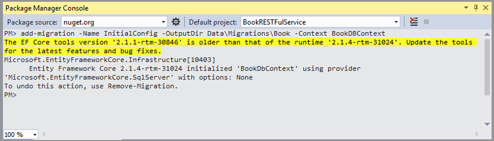

<u>Update Database</u>\
update-database command is the command that create the database and seeding of initial data using the given DBContext. \
__PM>__ _update-database_

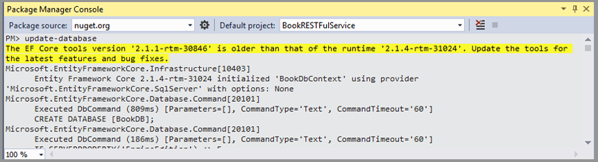

---

### Implementing RESTFul API

#### Creating Controller File

- Right click on the _**Controller**_ Folder and select _**Add New Item**_. Choose _**API Controller**_ 
from the template list and name the controller file as _**BookController.cs**_.
- System will create _**BookController.cs**_ file with API service template functions for _**GET, POST, PUT**_ 
and _**DELETE**_.
- We need to override all these templates with our own functions.
- For simplicity, in this project we will only provide only three services for retrieving book list, 
retrieving book detail and searching book. 
- We only need to implement _**GET**_ to provide these three API services.

##### Creating Constructor
- As _**BookController**_ require _**BookDBContext**_ to retrieve data from _**BookDB**_ Database, 
the constructor will accept _**BookDBContext**_ as parameter and save it in _**_context**_ variable.
The API services will use _**_context**_ for database related functions such as retriving and updating of data.

```C#
[Route("api/[controller]")]
public class BooksController : Controller
{
    private readonly BookDbContext _context;
        
    // Constructor 
    public BooksController(BookDbContext context)
    {
        _context = context;
    }
    ...
}
```

##### Retrieve Service
_**Service Link**_ : api\\books\\retrieve\\\{pagesize}\\\{pageno}

Retrieve service will retrieve the book list base on the _**pagesize**_ and _**pageno**_ parameters.
The service will return a Tuple which contains book list and pagination information.

```C#
[HttpGet("retrieve/{pagesize}/{pageno}")]
public async Task<Tuple<IEnumerable<Book>, Pagination>> Get(int pagesize, int pageno)
{
    Pagination  pagination  = new Pagination();

    pagination.PageNo       = pageno;
    pagination.PageSize     = pagesize;
            
    var query = _context.Books.AsNoTracking().OrderBy(m => m.Title);                                                      // Prepare Query
    pagination.TotalCount = await query.CountAsync().ConfigureAwait(false);                                               // Get the Record TotalCount.

    var result = await query.Skip((pagination.PageNo - 1) * pagination.PageSize).Take(pagination.PageSize).ToListAsync(); // Retrieve data based on Page No. and Page Size
    return new Tuple<IEnumerable<Book>, Pagination>(result, pagination);                                                  // Return 2 Models, Movie Model and Pagination Model            
}
```
##### Retrieve Detail Service
_**Service Link**_ : api\\books\\retrieve\\\{Isbn}

Retrieve detail service will retrieve the information of particular book base on the _**Isbn**_ parameter.
The service will return a _**Book**_ model which contains information of the request book.

```C#
[HttpGet("retrieve/{isbn}")]
public async Task<Book> Get(string isbn)
{
    var book = await _context.Books.AsNoTracking().FirstOrDefaultAsync(b => b.Isbn == isbn);
    return (book);
}
```

##### Retrieve Detail Service
_**Service Link**_ : api\\books\\search\\\{keyword}\\\{pagesize}\\\{pageno}

Retrieve service will retrieve the book list base on the _**keyword**_, _**pagesize**_ and _**pageno**_ parameters.
The service will return a Tuple which contains book list that contains _**keyword**_ and pagination information.

```C#
[HttpGet("search/{keyword}/{pagesize}/{pageno}")]
public async Task<Tuple<IEnumerable<Book>, Pagination>> Search(string keyword, int pagesize, int pageno)
{
    Pagination pagination = new Pagination();

    pagination.PageNo       = pageno;
    pagination.PageSize     = pagesize;
                                    
    var query = _context.Books.AsNoTracking().Where(b => b.Title.ToLower().Contains(keyword.ToLower()));                        
    pagination.TotalCount = await query.CountAsync().ConfigureAwait(false);                                             

    var result = await query.Skip((pagination.PageNo - 1) * pagination.PageSize).Take(pagination.PageSize).ToListAsync(); 
    return new Tuple<IEnumerable<Book>, Pagination>(result, pagination);                                                  
}
```

##### Full Source Code of BookController RESTFul API Service

```C#
using System;
using System.Collections.Generic;
using System.Linq;
using System.Threading.Tasks;
using BookRESTFulService.Data;
using BookRESTFulService.Models;
using Microsoft.AspNetCore.Mvc;
using Microsoft.EntityFrameworkCore;

namespace BookRESTFulService.Controllers
{
    [Route("api/[controller]")]
    public class BooksController : Controller
    {
        private readonly BookDbContext _context;

        public BooksController(BookDbContext context)
        {
            _context = context;
        }

        [HttpGet("retrieve/{pagesize}/{pageno}")]
        public async Task<Tuple<IEnumerable<Book>, Pagination>> Get(int pagesize, int pageno)
        {
            Pagination pagination = new Pagination();

            pagination.PageNo = pageno;
            pagination.PageSize = pagesize;

            var query = _context.Books.AsNoTracking().OrderBy(m => m.Title);                                                      // Prepare Query
            pagination.TotalCount = await query.CountAsync().ConfigureAwait(false);                                               // Get the Record TotalCount.

            var result = await query.Skip((pagination.PageNo - 1) * pagination.PageSize).Take(pagination.PageSize).ToListAsync(); // Retrieve data based on Page No. and Page Size
            return new Tuple<IEnumerable<Book>, Pagination>(result, pagination);                                                  // Return 2 Models, Movie Model and Pagination Model            
        }

        [HttpGet("retrieve/{isbn}")]
        public async Task<Book> Get(string isbn)
        {
            var book = await _context.Books.AsNoTracking().FirstOrDefaultAsync(b => b.Isbn == isbn);
            return (book);
        }

        [HttpGet("search/{keyword}/{pagesize}/{pageno}")]
        public async Task<Tuple<IEnumerable<Book>, Pagination>> Search(string keyword, int pagesize, int pageno)
        {
            Pagination pagination = new Pagination();

            pagination.PageNo = pageno;
            pagination.PageSize = pagesize;

            var query = _context.Books.AsNoTracking().Where(b => b.Title.ToLower().Contains(keyword.ToLower()));
            pagination.TotalCount = await query.CountAsync().ConfigureAwait(false);

            var result = await query.Skip((pagination.PageNo - 1) * pagination.PageSize).Take(pagination.PageSize).ToListAsync();
            return new Tuple<IEnumerable<Book>, Pagination>(result, pagination);
        }
    }
}
```
---
### Testing RESTful API Services

We can use _**Postman**_ and _**SoapUI**_ tools to test Web APIs.

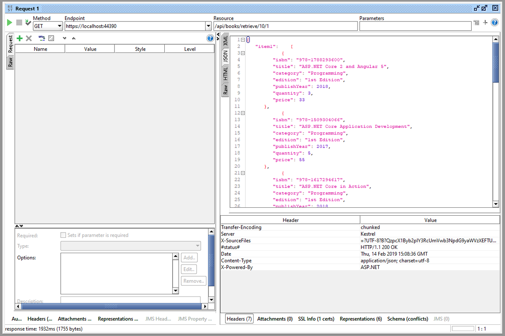


---

## Building Front-End Application
#### Creating New Front-End Application Project

The RESTFul API services that I have implemented earlier will act as Back-End part of the project. 
Now I will create new project to implement Front-End part of our project. 
To add the new project, right click on the solution and choose _**Add / New Project**.
Then select "ASP.NET Core Web Application" to crate ASP.NET Core based web application. 
On the dialog box, select "Web Application (Model-View-Controller)" project with "No Authentication"
and make sure "Configure for HTTPS" is checked.

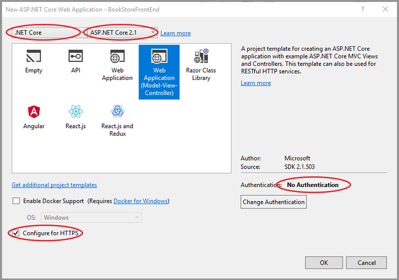


The new project for Front-End will created with following folders and files.

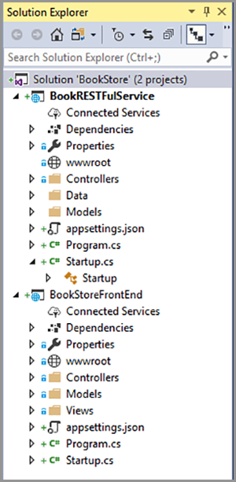

---

#### Creating API Helper Class

Create a new folder named _**Helper**_ in the project for helper classes.
Add a new class file named **BookAPI.cs** in the _**Helper**_ folder to implement API helper class.

##### API Helper Constructor
Constructor of _**BookAPI**_ class will create _**HttpClient()**_ and save it in variable which will be use by member 
methods.
```C#
public class BookAPI
{
    HttpClient httpClient;

    public BookAPI()
    {
        httpClient = new HttpClient();
        httpClient.BaseAddress = new Uri("https://localhost:44311");
    }
    ...
}
```

##### RetrieveBookList API Helper Function
_**RetrieveBookList**_ function is a helper function to access _**api/books/retrive/{pageSize}/{pageNo}**_ API Service 
from _**BookRESTFulService**_.

```C#
public async Task<T> RetrieveBookList<T>(Pagination pagination)
{
    HttpResponseMessage httpResponse = await httpClient.GetAsync("api/books/retrieve/" + pagination.PageSize + '/' + pagination.PageNo);

    T retrieveData = default(T);

    if (httpResponse.IsSuccessStatusCode)
    {
        var result = httpResponse.Content.ReadAsStringAsync().Result;
        retrieveData = JsonConvert.DeserializeObject<T>(result);
    }

    return (retrieveData);
}
```

##### SearchBook API Helper Function
_**SerachBook**_ function is a helper function to access _**api/books/search/{keyword}/{pageSize}/{pageNo}**_ API Service 
from _**BookRESTFulService**_.

```C#
public async Task<T> SearchBook<T>(string keyword, Pagination pagination)
{
    HttpResponseMessage httpResponse = await httpClient.GetAsync("api/books/search/" + Uri.EscapeDataString(keyword) + "/" + pagination.PageSize + '/' + pagination.PageNo);
    T retrieveData = default(T);

    if (httpResponse.IsSuccessStatusCode)
    {
        var result = httpResponse.Content.ReadAsStringAsync().Result;
        retrieveData = JsonConvert.DeserializeObject<T>(result);
    }

    return (retrieveData);
}
```

##### GetBookDetail API Helper Function
_**GetBookDetail**_ function is a helper function to access _**api/books/retrieve/{isbn}**_ API Service 
from _**BookRESTFulService**_.

```C#
public async Task<T> GetBookDetail<T>(string isbn)
{
    HttpResponseMessage httpResponse = await httpClient.GetAsync("api/books/retrieve/" + Uri.EscapeDataString(isbn));
    T retrieveData = default(T);

    if (httpResponse.IsSuccessStatusCode)
    {
        var result = httpResponse.Content.ReadAsStringAsync().Result;
        retrieveData = JsonConvert.DeserializeObject<T>(result);
    }

    return (retrieveData);
}
```

##### Complete BookAPI Source Code of Helper Class
```C#
using BookStoreFrontEnd.Models;
using Newtonsoft.Json;
using System;
using System.Collections.Generic;
using System.Linq;
using System.Net.Http;
using System.Threading.Tasks;

namespace BookStoreFrontEnd.Helper
{
    public class BookAPI
    {
        HttpClient httpClient;

        public BookAPI()
        {
            httpClient = new HttpClient();
            httpClient.BaseAddress = new Uri("https://localhost:44311");
        }

        // Helper for api/books/retrieve/{pagesize}/{pageno}
        public async Task<T> RetrieveBookList<T>(Pagination pagination)
        {
            HttpResponseMessage httpResponse = await httpClient.GetAsync("api/books/retrieve/" + pagination.PageSize + '/' + pagination.PageNo);
            T retrieveData = default(T);

            if (httpResponse.IsSuccessStatusCode)
            {
                var result = httpResponse.Content.ReadAsStringAsync().Result;
                retrieveData = JsonConvert.DeserializeObject<T>(result);
            }

            return (retrieveData);
        }

        // Helper for api/books/search/{keyword}/{pagesize}/{pageno}
        public async Task<T> SearchBook<T>(string keyword, Pagination pagination)
        {
            HttpResponseMessage httpResponse = await httpClient.GetAsync("api/books/search/" + Uri.EscapeDataString(keyword) + "/" + pagination.PageSize + '/' + pagination.PageNo);
            T retrieveData = default(T);

            if (httpResponse.IsSuccessStatusCode)
            {
                var result = httpResponse.Content.ReadAsStringAsync().Result;
                retrieveData = JsonConvert.DeserializeObject<T>(result);
            }

            return (retrieveData);
        }

        // Helper for api/books/retrieve/{isbn}
        public async Task<T> GetBookDetail<T>(string isbn)
        {
            HttpResponseMessage httpResponse = await httpClient.GetAsync("api/books/retrieve/" + Uri.EscapeDataString(isbn));
            T retrieveData = default(T);

            if (httpResponse.IsSuccessStatusCode)
            {
                var result = httpResponse.Content.ReadAsStringAsync().Result;
                retrieveData = JsonConvert.DeserializeObject<T>(result);
            }

            return (retrieveData);
        }
    }
}
```
---
#### Creating Models

Create _**Book.cs**_ file inside the model Folder and replicate the _**Book**_ model structure from _**RESTFul Service**_ Project.
This is to facilitate to handle _**Book**_ model response from API Service.

```C#
using System;
using System.Collections.Generic;
using System.ComponentModel.DataAnnotations;
using System.ComponentModel.DataAnnotations.Schema;
using System.Linq;
using System.Threading.Tasks;

namespace BookStoreFrontEnd.Models
{
    public class Book
    {
        [Key]
        [MaxLength(30)]
        public string Isbn { get; set; }
        [MaxLength(200)]
        public String Title { get; set; }
        [MaxLength(50)]
        public string Category { get; set; }
        [MaxLength(50)]
        public string Edition { get; set; }
        public int PublishYear { get; set; }
        public int Quantity { get; set; }
        [Column(TypeName = "decimal(10,2)")]
        public decimal Price { get; set; }
    }
}
```

In the same way, create _**Pagination.cs**_ file in _**Models**_ folder and replicate the _**Pagination**_ model structure form 
_**RESTFul Service**_ to handle response with _**Pagination**_ model.

```C#
using System;
using System.Collections.Generic;
using System.Linq;
using System.Threading.Tasks;

namespace BookStoreFrontEnd.Models
{
    public class Pagination
    {
        public int PageNo { get; set; } = 1;                    // Assign Default PageNo to 1.
        public int PageSize { get; set; } = 18;                 // Assign Default PageSize to 18.
        public int TotalCount { get; set; }
        public int PageButtonCount { get; set; } = 10;          // Assign Display PageButtonCount to 10;

        public int TotalPages => (int)Math.Ceiling(decimal.Divide(TotalCount, PageSize));
    }
}
```
---
#### Preparing UI Components

##### Changing Bootstrap Theme to Lumen
- Browse the bootswatch version 3 page https://bootswatch.com/3/. _(note:default is version 4 and not compatible with asp.net core 2.1 template)_
- Select the Lumen theme and download _**bootstrap.min.css**_.
- Rename the Lumen theme css file to _**bootstrap-lumen.min.css**_ and 
- copy to _**wwwroot\lib\bootstrap\dist**_ folder.

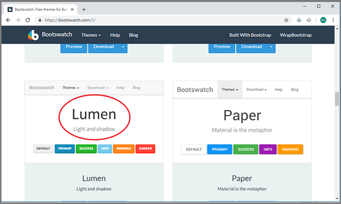

- Open _**Views\Shared\_Layout.cshtml**_ file and replace link tag of _**bootstarp.css**_ style 
sheet with _**bootstrap-lumen.min.css**_ for both _**Development**_ and _**Staging/Production**_ environment.


##### Adding Section Renderer for page specific CSS and Javascript
At the end of the _**&lt;head&gt;**_ tag in _**_Layout.cshtml**_ file, add _**page_css**_ section renderer to allow rendering of page specific css files.

At the end of the _**&lt;body&gt;**_ tag in _**_Layout.cshtml**_ file, add *page_script* section renderer to allow rendering of page specific script files.

In both section renderer, required parameter is false as this section is not mandatory and it will render only for the page those has special behaviour.

```HTML
<!DOCTYPE html>
<html>

<head>
	...

	@RenderSection("page_css", required:false)
</head>

<body>
	...

	@RenderSection("page_script", required: false)
</body>

</html>
```
##### Removing Unnecessary Controller Actions and Views
- Delete _**About.cshtml, Contact.cshtml, Privacy.cshtml**_ views from _**Views**_ folder.
- In HomeController, _**Controller\HomeController.cs**_, file, delete _**About, Contact**_ and 
_**Pravicy*_ actions.
- In _**Views\Shared\_Layout.cshtml**_ file delete the menu section _**&lt;ul&gt;**_ tag inside _**&lt;nav&gt;**_ tag
that render the menu items.
- Delete all content and empty _**Views\Home\Index.cshtml**_ file.

##### Adding Bootstrap Search Box

Open _**_Layout.cshtml**_ file and locate the tag `<div class="navbar-collapse collapse">` which lies inside the _**&lt;nav&gt;**_ tag.
Inside that tag, add the bootstrap search box. Add the attribute `asp-route-pageno="1"` in _**&lt;form&gt;**_ tag to ensure starts from page 1 for 
every new search. Change the _**&lt;input&gt;**_ tag's  _**name**_ attribute to _**keyword**_ . To ensure previous serached keyword to appear in the
search input box, set _**value**_ attribute of **&lt;input&gt;**_ tag to _**@ViewBag.keyword**_ .

```HTML
<nav class="navbar navbar-inverse navbar-fixed-top">
    <div class="container">
            
            ...
            
        <div class="navbar-collapse collapse">
            <form asp-controller="Home" asp-action="Index" asp-route-pageno="1" method="get" class="navbar-form navbar-right">
                <div class="input-group">
                    <input type="Search" name="keyword" placeholder="Search..." class="form-control" value="@ViewBag.keyword" />
                    <div class="input-group-btn">
                        <button type="submit" class="btn btn-info" onclick="">
                            <span class="glyphicon glyphicon-search"></span>
                        </button>
                    </div>
                </div>
            </form>
        </div>
    </div>
</nav>
```
<br/>

##### Designing Index View
###### Header part
In Index.cshtml, _**book**_ model which is actual data and _**pagniation**_ models which stores paging information 
will be use. Using of multiple model in a View can be archive by combining with _**Tuple**_ .
Add the _**page_css**_ section to add link to the page's stylesheet file.


```HTML
@model Tuple<IEnumerable<BookStoreFrontEnd.Models.Book>, BookStoreFrontEnd.Models.Pagination>

@*Link to page specific CSS file*@
@section page_css
{
    <link rel="stylesheet" href="~/css/home-index.css" />
}
```

###### Wrapper Div
Immediately after _**page_css**_ section, create wrapper div `<div class="home-index">` for the contents of index page.

```HTML
<div class="home-index">

    ...

</div>
```

###### Item Container

Item Containter is reside in the wrapper div and it render all the books in the List<Book> which is inside the _**Model.Item1**_.

```HTML
<div class="home-index">

    @*Rending Item Container*@
    <div class="ec-container">
        @*Loop through List<Book> and render all items*@
        @foreach (var item in Model.Item1)
        {
            <div class="item" data-value="@item.Isbn">
                <div class="ec-imagecell">
                    @*If file not found, it will use noimage.jpg*@
                    
                </div>
                <div class="ec-pricecell">
                    $@Html.DisplayFor(modelItem => item.Price)
                </div>                
            </div>
        }
    </div>

    ...

</div>
```

###### Bootstrap Pagination Control

The Paginiation control will use the information from Pagination Model which is inside the _**Model.Item2**_ to 
render the page buttons. 

```HTML
<div class="home-index">
    ...

    @*Render Pagination Area*@
    <nav>
        @{
            @*Ensure to render only pagination.PageButtonCount, based on Current Page No.*@
            var startPage = Model.Item2.PageNo - (Model.Item2.PageButtonCount / 2);
            var endPage = Model.Item2.PageNo + (Model.Item2.PageButtonCount / 2);
            endPage -= startPage < 0 ? startPage : 0;
            startPage -= endPage > Model.Item2.TotalPages ? endPage - Model.Item2.TotalPages : 0;

            @*Limit the start and end page number*@
            startPage = Math.Max(startPage, 0) + 1;
            endPage = Math.Min(endPage, Model.Item2.TotalPages);
        }

        @*Use larger pagination button*@
        <ul class="pagination pagination-lg">

            @*Render Previous Button*@
            <li class="page-item @(Model.Item2.PageNo <= 1 ? "disabled" :"")"> @* Disable previous button on 1st Page*@
                <a class="page-link" asp-route-pageno="@(Model.Item2.PageNo > 1 ? Model.Item2.PageNo - 1 : 1)" aria-label="Previous"> @*Link to Previous Page No.*@
                    <span aria-hidden="true">&laquo;</span>
                    <span class="sr-only">Previous</span>
                </a>
            </li>


            @*Render page buttons*@
            @for (var i = startPage; i <= endPage; i++)
            {
                <li class="page-item @(i == Model.Item2.PageNo ? "active" : "")">
                    <a asp-route-pageno="@i" asp-route-keyword="@ViewBag.keyword" class="page-link">@i</a>
                </li>
            }

            @*Render Next Button*@
            <li class="page-item @(Model.Item2.PageNo >= Model.Item2.TotalPages ? "disabled" :"")"> @* Disable next button on last Page*@
                <a class="page-link" asp-route-pageno="@(Model.Item2.PageNo < Model.Item2.TotalPages ? Model.Item2.PageNo + 1 : Model.Item2.TotalPages)" aria-label="Next"> @*Link to Next Page No.*@
                    <span aria-hidden="true">&raquo;</span>
                    <span class="sr-only">Next</span>
                </a>
            </li>
        </ul>
    </nav>

</div>
```

###### Bootstrap Modal
Bootstrap modal is render immediately after the wrapper div. This modal is use to display the detail information
of a particular book when user click the item on the list. The script section will handle the click event and 
request the Book's Detail information from _**BookRESTFulService**_ trough _**BookStoreFrontEnd**_'s  BookDetail.cshtml View.
After received the infomation from service, it will show the modal.

```HTML
@*Bootstrap modal*@
<div class="modal fade" id="bookDetailPopup" tabindex="-1" role="dialog" aria-labelledby="bookDetailPopupTitle" aria-hidden="true">
    <div class="modal-dialog modal-dialog-centered" role="document">
        <div class="modal-content">
            <div class="modal-header">
                <button type="button" class="close" data-dismiss="modal" aria-label="Close">
                    <span aria-hidden="true">&times;</span>
                </button>
                <h4 class="modal-title" id="bookDetailPopupTitle">Book's Detail Information</h4>
            </div>
            <div class="modal-body">
                <div id="modalContent"></div> @*Actual Content will appear in this <div> tag*@
            </div>
            <div class="modal-footer">
                <button type="button" class="btn btn-secondary" data-dismiss="modal">Close</button>
            </div>
        </div>
    </div>
</div>

@section scripts {
    <script type="text/javascript">

        $(document).ready(function () {
            $(".item").click(function () {
                var isbn = $(this).data('value'); // get the Isbn no. which stored in data-value attribute of the item.
                $('#modalContent').load('/bookdetails/' + isbn, function () {
                    $('#bookDetailPopup').modal('show');
                });
            });
        });
    </script>
}
```

##### Creating BookDetail View
Right click on the _**Views/Home**_ folder and select _**Add / View **_. In _**Add MVC View**_ dialog box, 
choose _**Details**_ template with _**Book**_ model and create as partial view. 

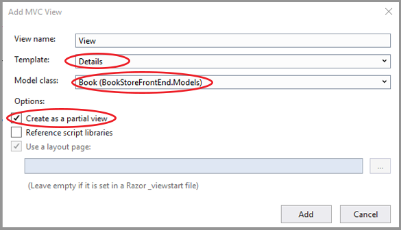

After _**BookDetails.cshtml**_ is created, amend the code as follows :

```HTML
@model BookStoreFrontEnd.Models.Book

<link rel="stylesheet" href="~/css/home.bookdetails.css" />

<div class="home_bookdetail">
    
    <div>
        <dl class="dl-horizontal">
            <dt>
                @Html.DisplayNameFor(model => model.Isbn)
            </dt>
            <dd>
                @Html.DisplayFor(model => model.Isbn)
            </dd>
            <dt>
                @Html.DisplayNameFor(model => model.Title)
            </dt>
            <dd>
                @Html.DisplayFor(model => model.Title)
            </dd>
            <dt>
                @Html.DisplayNameFor(model => model.Category)
            </dt>
            <dd>
                @Html.DisplayFor(model => model.Category)
            </dd>
            <dt>
                @Html.DisplayNameFor(model => model.Edition)
            </dt>
            <dd>
                @Html.DisplayFor(model => model.Edition)
            </dd>
            <dt>
                @Html.DisplayNameFor(model => model.PublishYear)
            </dt>
            <dd>
                @Html.DisplayFor(model => model.PublishYear)
            </dd>
            <dt>
                @Html.DisplayNameFor(model => model.Quantity)
            </dt>
            <dd>
                @Html.DisplayFor(model => model.Quantity)
            </dd>
            <dt>
                @Html.DisplayNameFor(model => model.Price)
            </dt>
            <dd>
                @Html.DisplayFor(model => model.Price)
            </dd>
        </dl>
    </div>
</div>
```
---
#### Creating Style Sheet

###### Create Style Sheet for Index View

Right click on the _**wwwroot\css**_ select _**add / new item**_ and add css file named **_home-index.css**_.
Add CSS rules as following code block. 

```CSS
.home-index {
    width: 100%;
    min-height: 700px;
}

.home-index .ec-container {
width: 100%;
height: 650px;
overflow: auto;
padding: 10px 10px;
-webkit-box-shadow: 0 0 10px #888;
-moz-box-shadow: 0 0 10px #888;
box-shadow: 0 0 10px #888;
margin-top: 20px;
}

.home-index .ec-container .item {
    position: relative;
    width: 180px;
    height: 190px;
    display: inline-block;
    text-align: center;
    padding: 10px 0px;
    margin-bottom: 10px;
    margin-top: 10px;
    font-family: Verdana, Arial, sans-serif;
    font-size: 10pt;
    cursor: pointer;
}

.home-index .ec-container .item:hover {
    -webkit-box-shadow: 0 0 10px #fc9090;
    -moz-box-shadow: 0 0 10px #fc9090;
    box-shadow: 0 0 10px #fc9090;
}

.home-index .ec-container .item .ec-imagecell {
    display: inline-block;
}

.home-index .ec-container .item .ec-imagecell img {
    width: 120px;
    min-width: 100px;
    height: 150px;
    margin-right: 10px;
}

.home-index .ec-container .item .ec-pricecell {
    display: inline-block;
    color: #ff4e35;
    width: 120px;
    text-align: center;
    font-size: 12pt;
    font-weight: bold;
}
```
To minimize the css conflict in future, I usually write page specific css codes in fully qualified selectors.

###### Create Style Sheet for BooksDetails View
Right click on the _**wwwroot\css**_ select _**add / new item**_ and add css file named **_home-bookdetails.css**_.
Add CSS rules as following code block. 

```CSS
.home-bookdetail img {
    display: block;
    max-height: 200px;
    margin-left: auto;
    margin-right: auto;
    margin-bottom: 10px;
}
```

#### Customizing Home Controller

###### Constructor

The Constructor will create an instance of _**BookAPI**_ helper class which will be use by other controller methods.

```C#
public class HomeController : Controller
{
    BookAPI bookApi;

    public HomeController()
    {
        bookApi = new BookAPI();
    }

    ...

}
```

###### Index View Action

The index view controller will handle for browsing of book list and searching of books. 

```C#
// For Retrive Book List and Search Book List
[Route("{pageno=1}")]
[HttpGet]
public async Task<IActionResult> Index(int pageno, String keyword = null)
{
    Pagination pagination = new Pagination();

    ViewBag.keyword = keyword;

    pagination.PageNo = pageno;

    if (!String.IsNullOrWhiteSpace(keyword))
    {
        var receiveData = await bookApi.SearchBook<Tuple<IEnumerable<BookStoreFrontEnd.Models.Book>, BookStoreFrontEnd.Models.Pagination>>(keyword, pagination);
        return View(receiveData);
    }
    else
    {
        var receiveData = await bookApi.RetrieveBookList<Tuple<IEnumerable<BookStoreFrontEnd.Models.Book>, BookStoreFrontEnd.Models.Pagination>>(pagination);
        return View(receiveData);
    }

}
```

###### BookDetails View Action
BookDetails view controller will return the partial view of the book details which will display in bootstrap modal.
```C#
// For Book Details Modal
[Route("{bookdetails}/{isbn}")]
[HttpGet]
public async Task<IActionResult> BookDetails(string isbn)
{
    var receiveData = await bookApi.GetBookDetail<BookStoreFrontEnd.Models.Book>(isbn);
    return (PartialView(receiveData));
}
```

###### Complete Source Code of HomeController

```C#
using System;
using System.Collections.Generic;
using System.Diagnostics;
using System.Linq;
using System.Threading.Tasks;
using Microsoft.AspNetCore.Mvc;
using BookStoreFrontEnd.Models;
using BookStoreFrontEnd.Helper;

namespace BookStoreFrontEnd.Controllers
{
    public class HomeController : Controller
    {
        BookAPI bookApi;

        public HomeController()
        {
            bookApi = new BookAPI();
        }

        // For Retrive Book List and Search Book List
        [Route("{pageno=1}")]
        [HttpGet]
        public async Task<IActionResult> Index(int pageno, String keyword = null)
        {
            Pagination pagination = new Pagination();

            ViewBag.keyword = keyword;

            pagination.PageNo = pageno;

            if (!String.IsNullOrWhiteSpace(keyword))
            {
                var receiveData = await bookApi.SearchBook<Tuple<IEnumerable<BookStoreFrontEnd.Models.Book>, BookStoreFrontEnd.Models.Pagination>>(keyword, pagination);
                return View(receiveData);
            }
            else
            {
                var receiveData = await bookApi.RetrieveBookList<Tuple<IEnumerable<BookStoreFrontEnd.Models.Book>, BookStoreFrontEnd.Models.Pagination>>(pagination);
                return View(receiveData);
            }

        }

        // For Book Details Modal
        [Route("{bookdetails}/{isbn}")]
        [HttpGet]
        public async Task<IActionResult> BookDetails(string isbn)
        {
            var receiveData = await bookApi.GetBookDetail<BookStoreFrontEnd.Models.Book>(isbn);
            return (PartialView(receiveData));
        }

        [ResponseCache(Duration = 0, Location = ResponseCacheLocation.None, NoStore = true)]
        public IActionResult Error()
        {
            return View(new ErrorViewModel { RequestId = Activity.Current?.Id ?? HttpContext.TraceIdentifier });
        }
    }
}

```
---

### Copying Book Images
- Create a new folder named _**books**_ folder under _**wwwroot\images**_ folder.
- Copy the book related images to that folder.


After copying the book images, the project is fully completed.

_____

Kyi Phyo Cho@Albert Cho